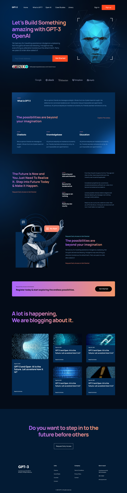

# AI Website

This repo houses the code for a cutting-edge React AI website, packed with sleek components and a dynamic, responsive design.
Feel free to tweak it further if you want!
This website is created for the sole purpose of enhancing my React knowlodge 

This project was bootstrapped with [Create React App](https://github.com/facebook/create-react-app).

## Table of Contents

- [Demo](#Figma-design)
- [Features](#features)
- [Installation](#installation)
- [Technologies Used](#technologies-used)
- [Feel like Contributing](#contributing)
- [License](#license)

## Figma-design



Getting Excited ! Check it out ---> [GPT-3](https://aryannxroot.github.io/Ai_website).

## Features

- Responsive design
- Interactive UI components
- Modern layout and design
- Integration with AI resources
- Detailed blog section

## Installation

To get started with the project, clone the repository and install the necessary dependencies:

```bash
git clone https://github.com/yourusername/Ai_website.git
cd AI_website
npm i
```

After installing the dependencies, you can start the development server:

```bash
npm start
```

Open your browser and navigate to `http://localhost:3000` to view the website.


## Technologies Used

- **React**: A JavaScript library for building user interfaces.
- **CSS3**: For styling components.
- **JavaScript (ES6+)**: Modern JavaScript features.
- **HTML5**: For structuring the web content.
- **Figma**: For designing the UI prototype.

## Contributing

Contributions are welcome! Please feel free to submit a Pull Request.

## Author

Aryan (@aryannxroot)

## License

This project is licensed under the MIT License. See the [MIT LICENSE](./LICENSE) file for more information.
